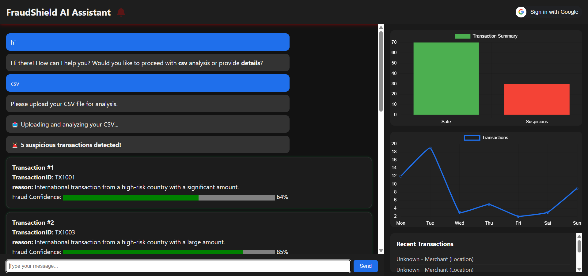

# 🛡️ FraudShield_AI

An AI-powered fraud detection assistant with real-time chart visualizations, built-in Google Sign-In, and a modern dark-themed UI. This project combines Gemini AI with a FastAPI backend and a responsive frontend hosted on GitHub Pages.

🔗 **Live Demo:** [https://gomit-dev.github.io/FraudShield_AI/](https://gomit-dev.github.io/FraudShield_AI/)

---

## ✨ Features

- 🧠 AI-powered fraud detection assistant using Gemini API  
- 🔐 Google Sign-In for authentication  
- 📊 Dynamic bar and line charts updated based on user input  
- 🌙 Clean, dark-themed UI  
- ⚡ FastAPI backend for AI interaction  
- 🌐 Frontend deployed on GitHub Pages  

---

## 📦 Tech Stack

- **Frontend:** HTML, CSS, JavaScript  
- **Backend:** Python, FastAPI  
- **AI Model:** Gemini API (Google)  
- **Authentication:** Google Sign-In (OAuth 2.0)  
- **Deployment:** GitHub Pages (frontend), local/cloud backend (FastAPI)  

---

## 🚀 Getting Started

### 1. Clone the Repository

```bash
git clone https://github.com/gomit-dev/FraudShield_AI.git
cd FraudShield_AI
```

---

### 📸 Screenshots


